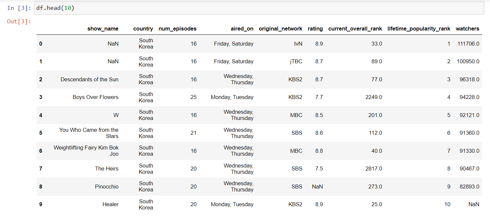
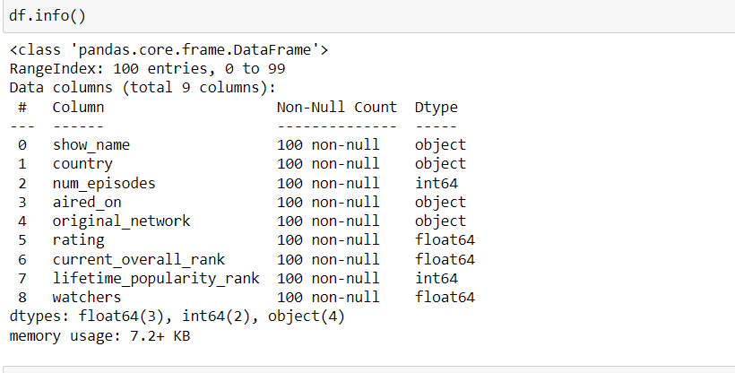

# Ex-01_DS_Data_Cleansing

## AIM
To read the given data and perform data cleaning and save the cleaned data to a file. 

# Explanation
Data cleaning is the process of preparing data for analysis by removing or modifying data that is incorrect ,incompleted , irrelevant , duplicated or improperly formatted. 
Data cleaning is not simply about erasing data ,but rather finding a way to maximize datasets accuracy without necessarily deleting the information. 

# ALGORITHM
### STEP 1
Read the given Data
### STEP 2
Get the information about the data
### STEP 3
Remove the null values from the data
### STEP 4
Save the Clean data to the file

# CODE
~~~
#PROGRAM DEVELOPED BY : K.BALAJI
#REGISTER NUMBER : 212221230011

import pandas as pd
df=pd.read_csv("Data_set.csv")
df.head(10)
df.info()
df.isnull().sum()
df['show_name']=df['show_name'].fillna(df['show_name'].mode()[0])
df['aired_on']=df['aired_on'].fillna(df['aired_on'].mode()[0])
df['current_overall_rank']=df['current_overall_rank'].fillna(df['current_overall_rank'].mode()[0])
df['rating']=df['rating'].fillna(df['rating'].mean())
df['watchers']=df['watchers'].fillna(df['watchers'].median())
f['original_network']=df['original_network'].fillna(df['original_network'].mode()[0])
df.head()
df.info()

~~~
# OUTPUT
## ORIGINAL DATA :

## DATA OF NON-COUNT BEFORE DATA CLEANING :

## SUM OF NULL :

## OUTPUT 1 :

## OUTPUT 2 :

## OUTPUT 3 :

## UPDATED DATA AFTER DATA CLEANING :

## DATA OF NON-COUNT AFTER DATA CLEANING :

# RESULT
The given data is read and data cleaning is performed using python and saved to a file.